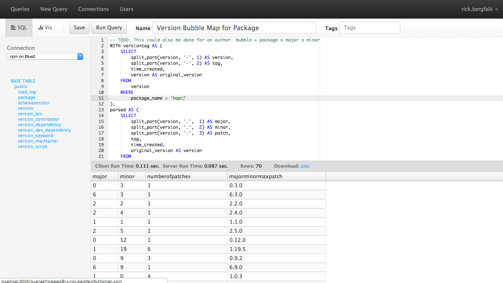

# SqlPad

A Node.js web app for writing and running SQL queries and visualizing the results. Supports Postgres, MySQL, SQL Server, Crate and Vertica.



SqlPad is meant to be run on an internal network for a single team. All connections added to the app can be used by all individuals with access to the SqlPad server. All queries written can be run and edited by everyone on the server. 

If you want to be bold and daring, you can expose your SqlPad instance to the outside world. Please make sure you fully understand the risks associated with doing this and use SSL.


## Installation & Usage

First, install Node.js and then

```sh
npm install sqlpad -g
```

For more info visit the project page at [http://rickbergfalk.github.io/sqlpad/](http://rickbergfalk.github.io/sqlpad/).

## Tips

If you have highlighted just part of your query, only that part will be executed when you click Run Query.

## Configuration

### IP Address

By default SqlPad will listen from all available addresses (0.0.0.0). This may be overridden via the `--ip` flag or the `SQLPAD_IP` environment variable.

### Port

By default SqlPad will use port 80. This may be overridden via cli parameter `--port` or environment variable `SQLPAD_PORT`.

### Encryption Passphrase 

SqlPad uses very simple encryption when storing database connection passwords. A custom encryption passphrase may be set via cli parameter --passphrase or environment variable SQLPAD_PASSPHRASE.

### Query result record limit
To change the maximum records returned by a SQL query, add a new item with key `queryResultMaxRows` and set the value to the max number of rows you would like returned. If the key is missing or set to a non-number, SqlPad will return a maximum of 50,000 rows.

### Disable CSV download
To disable CSV downloads, visit the "Configuration" page and add a new item with key `allowCsvDownload` and value `false`. If the key is missing or set to any other value, CSV downloads will be enabled.

### Show Schema Copy Buttons
Some databases (like Vertica) require the fully qualified table and column names
within a SQL statement. This can be a hassle to remember or type when you have long and complicated names. For convenience, you can enable fully-qualified-name copy buttons that appear in the schema sidebar. When hovering over an item in the schema tree, a copy button will appear. Click it and the schema name, table name, and column name will be copied to your clipboard.

To enable the schema copy buttons, add a new configuration item with key `showSchemaCopyButton` with value `true`.

## Development Setup

If you want to hack on SqlPad, here's a guide as to what my workflow has been like:

First clone or download this repo. Then install dependencies.

```sh
npm install
```

Install browserify to compile client-side scripts

```sh
npm install browserify -g
``` 

Optionally install watchify to automatically browserify your client-side scripts

```sh
npm install watchify -g
```

To start SqlPad on port 3000  with datafiles in ./db run 

```sh
npm start
```

To bundle client-side scripts run 

```sh 
npm run bundle
```

or to auto-browserify as changes happen

```sh
npm run watchify
```


## License 

MIT
