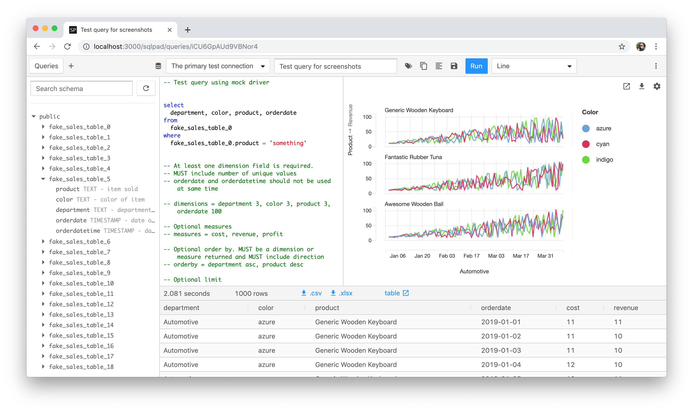

# SQLPad

A web app for writing and running SQL queries and visualizing the results. Supports Postgres, MySQL, SQL Server, Crate, Vertica, Presto, SAP HANA, Snowflake, BigQuery, SQLite, and many others via ODBC.

## Database Support

  

    
  

  

    
  

  

    
  

  

    
  

  
Crate

  
Presto

  
SAP Hana

  
Apache Drill

  
Cassandra

  
Snowflake

  
BigQuery

  
SQLite

  
Many others via ODBC

## Is SQLPad for me?

SQLPad is a self-hosted web app for writing and running SQL queries
and optionally visualizing the results. It's a simple tool for
exploratory data work and visualizations, or quick convenient access to run a SQL query here and there.

It's hackable and basic.

## Why not SQLPad?

It's not a dashboarding tool, and likely will never become one. If you're looking for open-source dashboarding check out [redash](https://redash.io/), [Metabase](https://www.metabase.com/) or [Superset](https://github.com/apache/incubator-superset).

It can't handle a query with 2 columns returned of the same name.

It uses an in-memory database and is intended to be run as a single instance. Running multiple instances with loadbalancing in front will yield unpredictable results.

It's written in Node.js, which was exciting in 2014 but in hindsight Python or Java would have been a better choice.

It's hackable and basic.
